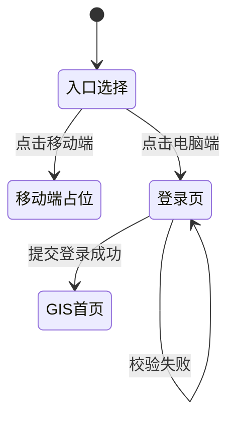
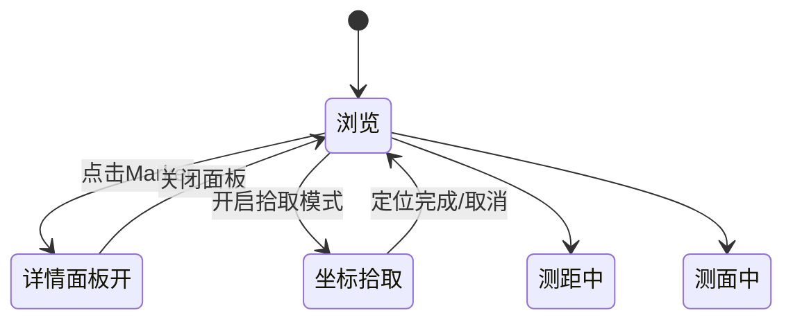
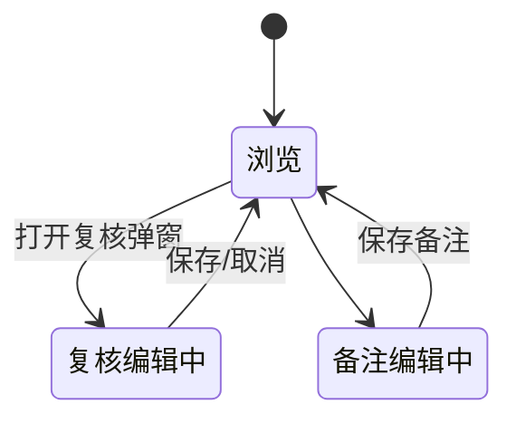
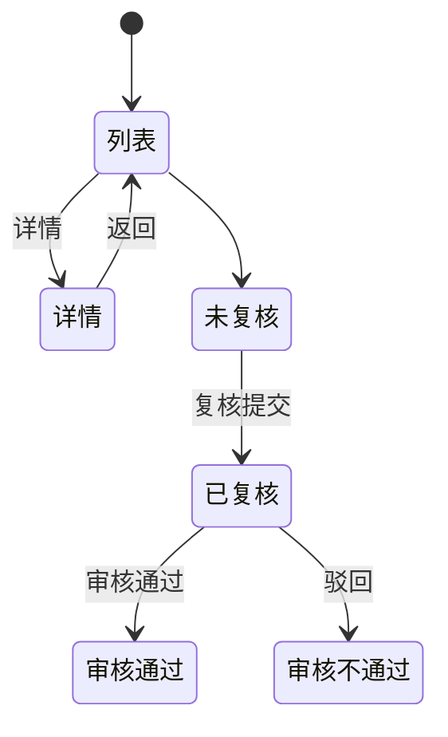
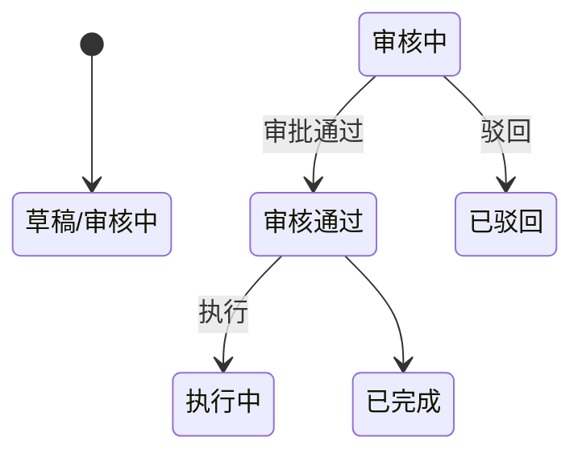
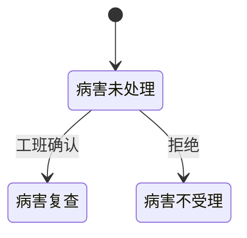
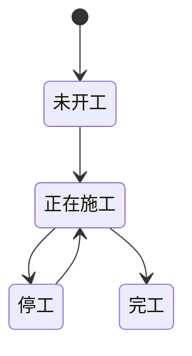
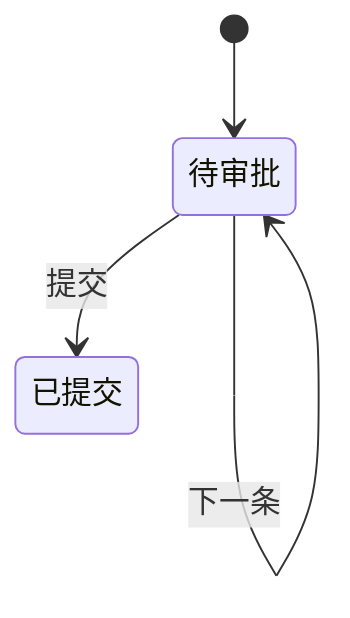
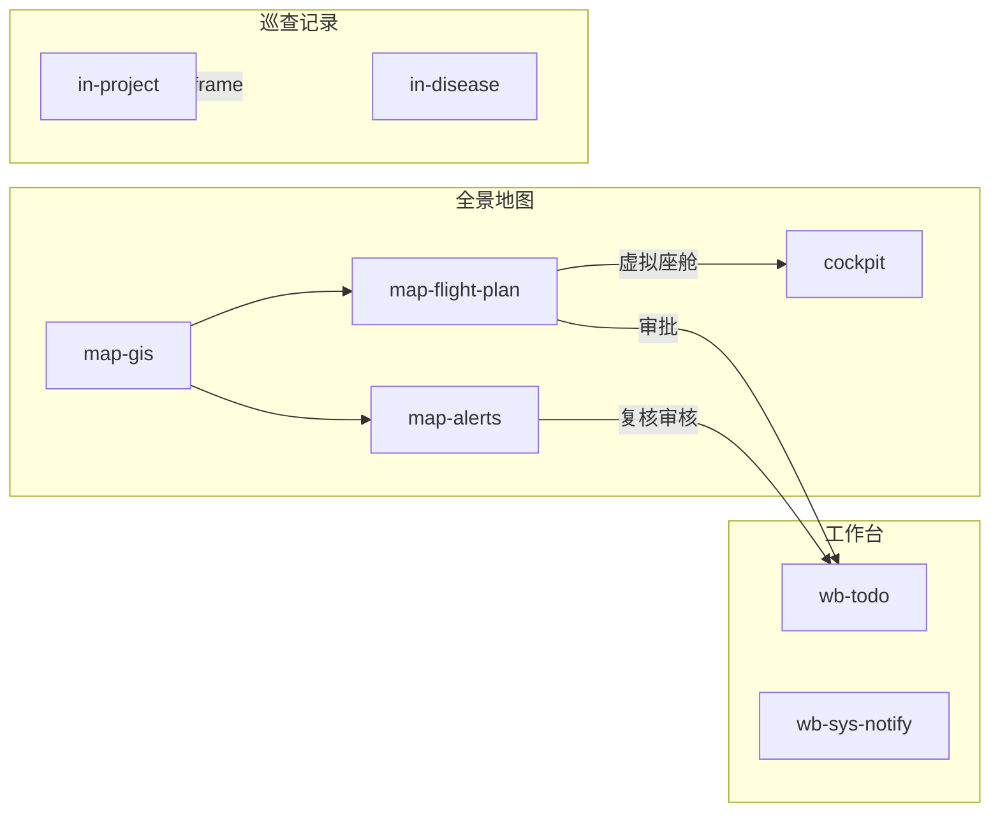

# 武汉地铁保护区管理平台 — 产品需求文档（PRD）

| 项目 | 说明 |
|------|------|
| 文档版本 | V1.1 |
| 依据 | 当前 HTML/JS 原型（根目录页面 + `assets/` 公共资源） |
| 视觉规范 | 深色 B2B 运维主题（`theme.css`）：青蓝高亮、霓虹面板、主按钮 `wh-btn-primary`、幽灵按钮 `wh-btn-ghost` |
| 布局框架 | 顶栏 64px + 巡查/统计侧栏 260px；工作台无侧栏，超级卡片入口 |
| 路径书写约定 | 操作入口统一为界面中文菜单路径，格式：**一级 → 二级 → 三级**（与顶栏、侧栏、工作台卡片文案一致） |

---

## 一、系统概述

武汉地铁保护区管理平台面向地铁保护区运营、巡检、空域与应急业务，提供 **GIS 全景态势**、**无人机虚拟座舱**、**巡查与项目档案**、**AI 风险识别**、**数据统计** 及 **统一工作台** 能力。系统以「一张图」掌握线网、项目、告警与设备状态，以流程化审批串联飞行计划、告警复核与待办通知，支撑保护区内在建项目全生命周期监管与无人机规范化作业。

本 PRD 依据现有可交互原型编写，描述页面结构、字段、状态与交互规则，作为产品设计评审与研发拆分的基准文档。

---

## 二、主要目标

| 目标维度 | 说明 |
|----------|------|
| **安全管控** | 对保护区内外施工、病害、夜班作业及 AI 预警进行记录、复核与闭环处置，降低结构安全风险。 |
| **空域合规** | 飞行计划审批、空域许可提醒、起飞前校验与虚拟座舱执行，保障无人机作业合法可控。 |
| **资源统筹** | 统管线路/站点/区间、机场无人机、应急资源与航线库，形成可检索的资产台账。 |
| **协同效率** | 待办、系统通知、已处理事项与跨模块跳转（地图↔告警↔飞行计划↔巡查），减少信息孤岛。 |
| **决策可视** | 态势感知瀑布图、专家频谱分析、统计报表与 GIS 图层叠加，辅助研判与汇报。 |
| **可运营可配** | 用户/角色/字典/消息模板等系统管理能力，支撑多部门、多角色长期使用（原型已预留入口）。 |

---

## 三、受众群体

| 受众群体 | 群体描述 | 典型使用场景 |
|----------|----------|--------------|
| **保护区运管人员** | 地铁运营单位保护区日常管理岗，负责项目备案、巡查督办与工班确认。 | 项目管理、病害/夜班/人工巡查、工班确认、操作记录追溯。 |
| **巡检与现场人员** | 巡查员、夜班施工方对接人，负责现场信息采集与媒体上传。 | 病害巡查录入、夜班作业登记、人工巡查记录、项目进展填报。 |
| **无人机调度与飞手** | 负责飞行计划编制、审批配合、机场选择与空中作业。 | 飞行计划、航线管理、虚拟座舱起飞准备/飞行中、飞行日志查看。 |
| **告警与研判专家** | 对结构告警、AI 预警进行复核、审核与技术研判。 | 态势感知、专家工具、告警信息、AI 识别审批、待办告警处理。 |
| **领导与统计分析人员** | 需要宏观指标、报表与导出能力的管理或分析岗。 | 线路项目统计、全时全域报表、巡查打分、分析报告。 |
| **系统与设备管理员** | IT 运维及设备台账管理员。 | 用户/角色/字典、机场无人机、维修记录、资源监控、资料库。 |
| **审批与综合办公人员** | 处理跨模块待办、通知与已办归档。 | 待办（审批/告警）、系统通知、已处理事项。 |

---

## 四、产品形态

| 形态 | 说明 |
|------|------|
| **电脑端 Web 后台** | 主产品形态。深色 B2B 运维界面，固定顶栏 + 内容区；巡查记录、数据统计模块带左侧树形菜单；工作台以超级卡片导航进入各子功能。推荐 Chrome/Edge，分辨率 ≥1920×1080。 |
| **移动端** | 原型入口页预留「移动端」卡片（`app/index.html` 占位），当前版本以说明性页面为主，业务功能在电脑端完整实现。 |
| **统一登录入口** | 根入口页选择电脑端/移动端；电脑端登录后默认进入 **全景地图 → GIS 地图首页**。 |
| **页面嵌入** | 部分巡查页支持 `?embed=1` 嵌入项目详情 iframe，隐藏顶栏侧栏，用于「项目管理 → 巡查」场景。 |
| **原型特性** | 当前为静态前端原型：数据存于页面脚本样例、部分筛选/导出为 UI 占位；登录任意账号密码可进入（演示用）。 |

---

## 五、角色说明

| 角色名称 | 职责概述 | 可访问模块（按原型菜单） | 关键权限特征 |
|----------|----------|--------------------------|--------------|
| **系统管理员** | 用户、角色、字典、参数、菜单、日志、消息模板、资源监控等配置与巡检。 | 我的工作台 → 系统管理（全部子菜单） | 最高配置权；可重置密码、分配角色与菜单权限（原型 UI 已体现）。 |
| **运管调度员** | GIS 态势查看、告警处置、飞行计划审批、待办处理、通知阅读。 | 全景地图（含飞行计划、告警）、虚拟座舱、我的工作台 → 待办/通知 | 审批、复核、审核、批量审批、导出告警列表。 |
| **巡检管理员** | 保护区项目档案、巡查记录督办、巡查质量分析。 | 巡查记录、我的工作台 → 智慧巡检 | 项目 CRUD、巡查 iframe、工班确认/拒绝、完工项目只读。 |
| **现场巡查员** | 病害、夜班、人工巡查数据录入与媒体上传。 | 巡查记录 → 病害巡查 / 夜班作业 / 人工巡查记录 | 新增编辑本业务数据；无系统配置权。 |
| **无人机操作员** | 航线维护、计划申请、座舱执行、日志查看。 | 全景地图 → 飞行计划、虚拟座舱；我的工作台 → 航线管理、飞行日志 | 虚拟座舱、空域校验、查看报告；设备只读或受限编辑。 |
| **设备管理员** | 线路站点区间、机场无人机、维修与应急资源维护。 | 我的工作台 → 资产管理 | 资产 CRUD、详情地图、树形机场-无人机。 |
| **数据分析员** | 报表查看、资料库维护、设备使用分析。 | 数据统计；我的工作台 → 数据中心 | 只读看板为主；资料库可编辑。 |
| **AI 审批员** | AI 风险预警筛选、影像查看与审批填报。 | AI识别 | 全屏审批工作台；连续处理下一条。 |

> 说明：原型未实现后端 RBAC 拦截，上表按菜单设计与页面能力推导；正式系统需与「角色管理」菜单权限树绑定。

---

## 六、全站操作入口索引（中文路径）

### 6.1 顶栏一级菜单

| 中文路径 | 页面名称 |
|----------|----------|
| 全景地图 | GIS 地图首页 |
| 虚拟座舱 | 虚拟座舱（起飞准备） |
| 巡查记录 → 病害巡查 | 病害巡查 |
| 巡查记录 → 夜班作业 | 夜班作业 |
| 巡查记录 → 无人机巡查记录 | 无人机巡查记录 |
| 巡查记录 → 人工巡查记录 | 人工巡查记录 |
| AI识别 | AI 识别 |
| 数据统计 → 线路项目统计 | 线路项目统计 |
| 数据统计 → 全时全域数据统计报表 | 全时全域数据统计报表 |
| 我的工作台 | 工作台超级卡片首页 |
| 顶栏 → 待办 | 待办 |
| 顶栏 → 系统通知 | 系统通知 |

### 6.2 巡查记录侧栏（进入巡查类页面后）

| 中文路径 | 页面名称 |
|----------|----------|
| 巡查记录 → 病害巡查 | 病害巡查 |
| 巡查记录 → 夜班作业 | 夜班作业 |
| 巡查记录 → 巡查记录 → 无人机巡查记录 | 无人机巡查记录 |
| 巡查记录 → 巡查记录 → 人工巡查记录 | 人工巡查记录 |

### 6.3 全景地图子页面（页面内跳转）

| 中文路径 | 页面名称 |
|----------|----------|
| 全景地图 → GIS 地图首页 | GIS 地图首页 |
| 全景地图 → GIS 地图首页 → 态势感知 | 态势感知 |
| 全景地图 → 态势感知 → 专家工具 | 专家工具 |
| 全景地图 → GIS 地图首页 → 飞行计划 | 飞行计划 |
| 全景地图 → GIS 地图首页 → 告警信息 | 告警信息 |
| 全景地图 → 飞行计划 → 虚拟座舱 | 虚拟座舱（起飞准备） |
| 全景地图 → 虚拟座舱 → 飞行中 | 虚拟座舱（飞行中） |

### 6.4 我的工作台 → 超级卡片

| 中文路径 | 页面名称 |
|----------|----------|
| 我的工作台 → 个人中心 → 待办 | 待办 |
| 我的工作台 → 个人中心 → 系统通知 | 系统通知 |
| 我的工作台 → 个人中心 → 已处理事项 | 已处理事项 |
| 我的工作台 → 个人中心 → 航线管理 | 航线管理 |
| 我的工作台 → 智慧巡检 → 保护区项目 → 项目管理 | 项目管理 |
| 我的工作台 → 智慧巡检 → 保护区项目 → 完工项目 | 完工项目 |
| 我的工作台 → 智慧巡检 → 巡查质量 → 人员轨迹 | 人员轨迹 |
| 我的工作台 → 智慧巡检 → 巡查质量 → 统计分析 | 统计分析 |
| 我的工作台 → 智慧巡检 → 巡查质量 → 巡查打分 | 巡查打分 |
| 我的工作台 → 资产管理 → 地铁路网管理 → 线路管理 | 线路管理 |
| 我的工作台 → 资产管理 → 地铁路网管理 → 站点管理 | 站点管理 |
| 我的工作台 → 资产管理 → 地铁路网管理 → 区间管理 | 区间管理 |
| 我的工作台 → 资产管理 → 应急管理 → 应急人员 | 应急人员 |
| 我的工作台 → 资产管理 → 应急管理 → 应急仓库 | 应急仓库 |
| 我的工作台 → 资产管理 → 应急管理 → 应急预案 | 应急预案 |
| 我的工作台 → 资产管理 → 无人机设备管理 → 机场设备管理 | 机场设备管理 |
| 我的工作台 → 资产管理 → 无人机设备管理 → 无人机设备管理 | 无人机设备管理 |
| 我的工作台 → 数据中心 → 分析报告 | 分析报告 |
| 我的工作台 → 数据中心 → 飞行日志记录 | 飞行日志记录 |
| 我的工作台 → 数据中心 → 维修与检修记录 | 维修与检修记录 |
| 我的工作台 → 数据中心 → 资料库 | 资料库 |
| 我的工作台 → 系统管理 → 用户管理 | 用户管理 |
| 我的工作台 → 系统管理 → 角色管理 | 角色管理 |
| 我的工作台 → 系统管理 → 部门管理 | 部门管理 |
| 我的工作台 → 系统管理 → 岗位管理 | 岗位管理 |
| 我的工作台 → 系统管理 → 菜单管理 | 菜单管理 |
| 我的工作台 → 系统管理 → 字典管理 | 字典管理 |
| 我的工作台 → 系统管理 → 日志管理 | 日志管理 |
| 我的工作台 → 系统管理 → 参数设置 | 参数设置 |
| 我的工作台 → 系统管理 → 通知公告 | 通知公告 |
| 我的工作台 → 系统管理 → 消息模板 | 消息模板 |
| 我的工作台 → 系统管理 → 资源监控 | 资源监控 |
| 我的工作台 → 系统管理 → 工作流 → 流程分类 | 流程分类 |
| 我的工作台 → 系统管理 → 工作流 → 流程设计 | 流程设计 |
| 我的工作台 → 系统管理 → 权限管理 | 权限管理 |

### 6.5 项目内嵌入口

| 中文路径 | 说明 |
|----------|------|
| 我的工作台 → 智慧巡检 → 项目管理 → 巡查 → 人工巡查 | 嵌入人工巡查记录 |
| 我的工作台 → 智慧巡检 → 项目管理 → 巡查 → 无人机巡查 | 嵌入无人机巡查记录 |
| 我的工作台 → 资产管理 → 应急管理 → 应急仓库 → 查看物资 | 应急物资（关联仓库） |

---

## 【系统入口与全局框架】

### 1、双端入口与登录

- **需求说明**：用户从统一入口选择移动端或电脑端；电脑端用户登录后进入 GIS 全景地图首页，作为运维后台主工作台。
- **操作入口**：系统入口页 → 电脑端；登录成功后进入 **全景地图 → GIS 地图首页**。
- **交互动作**：
  1. 打开入口页，展示「移动端」「电脑端」两张卡片；
  2. 点击「电脑端」进入登录页；
  3. 输入账号、密码，点击「登录」；
  4. 表单校验通过后进入 **全景地图 → GIS 地图首页**。
- **规则说明**：
  - 原型阶段任意账号密码均可登录；
  - 账号、密码为必填项（HTML5 `required`）；
  - 登录页使用 `wh-main-canvas` 深色背景与居中 `neon-panel` 卡片（最大宽度 400px）。
- **异常处理**：
  - 未填账号/密码：浏览器原生 `reportValidity` 提示，不跳转；
  - 网络/资源加载失败：样式降级，功能按钮仍可见（静态原型无后端）。
- **输出结果**：进入 GIS 地图全屏页，顶栏显示平台名称与一级菜单。
- **业务状态机说明**：

- **字段说明**：

| 字段名称 | 类型 | 必填 | 默认值 | 取值范围 |
|----------|------|------|--------|----------|
| 账号 | 文本 | 是 | 空 | 任意非空（原型） |
| 密码 | 密码 | 是 | 空 | 任意非空（原型） |

---

### 2、全局顶栏与菜单导航

- **需求说明**：已登录用户在任意业务页通过顶栏切换一级模块、搜索菜单、查看待办/通知角标、退出系统。
- **操作入口**：登录后任意业务页 **顶栏导航区**（全景地图 / 虚拟座舱 / 巡查记录 / AI识别 / 数据统计 / 我的工作台，及待办、系统通知图标）。
- **交互动作**：
  1. 点击一级菜单（全景地图、虚拟座舱、巡查记录下拉、AI识别、数据统计下拉、我的工作台）跳转对应页面；
  2. 点击放大镜打开「搜索菜单」遮罩，输入关键字过滤，点击结果跳转；
  3. 点击顶栏 **待办** / **系统通知** 图标，分别进入 **顶栏 → 待办**、**顶栏 → 系统通知**；
  4. 点击用户区展开下拉，选择「退出登录」返回 **系统入口页**；
  5. 巡查记录、数据统计为悬停展开下拉子项。
- **规则说明**：
  - 当前页面对应一级菜单高亮（`wh-top-nav--active` / 下拉按钮激活态）；
  - 待办角标统计状态为「待审批」「未复核」「已复核」；通知角标统计「未读」；
  - 已读通知 ID 存 `localStorage` 键 `whmetro-notify-read`；
  - 工作台类页面 `data-top="wb"` 不显示左侧树形侧栏。
- **异常处理**：
  - 搜索无匹配：展示「未找到匹配的菜单」；
  - 角标为 0 时隐藏红点徽章容器。
- **输出结果**：目标 HTML 页面加载，顶栏状态与菜单高亮同步。
- **业务状态机说明**：顶栏常驻；下拉菜单 `mouseenter` 展开、`mouseleave` 收起；用户菜单点击切换 `aria-expanded`。
- **字段说明**：

| 字段名称 | 类型 | 必填 | 默认值 | 取值范围 |
|----------|------|------|--------|----------|
| 菜单搜索关键字 | 文本 | 否 | 空 | 匹配菜单 label（`collectAllMenuItems`） |
| 待办角标数 | 数字 | — | 动态 | 0–99+ |
| 未读通知数 | 数字 | — | 动态 | 0–99+ |

---

### 3、工作台超级卡片导航（Hub）

- **需求说明**：运维人员从「我的工作台」快速进入个人中心、智慧巡检、资产管理、数据中心、系统管理等二级功能，支持卡片内搜索。
- **操作入口**：顶栏 **我的工作台** → 工作台超级卡片首页。
- **交互动作**：
  1. 页面加载后全屏展示 5 张超级卡片（`workbench-mega.js` + `WB_MEGA` 配置）；
  2. 卡片内分组可折叠（subtitle 区块）；
  3. 顶部搜索框输入关键字，过滤叶子菜单显示/隐藏；
  4. 点击叶子链接跳转对应 HTML。
- **规则说明**：
  - 菜单数据与 `menu-config.js` 的 `WB_MEGA` 同步；
  - `hidden` 标记的菜单项（如部分运维页）不在 Hub 展示；
  - 当前 `data-sidebar-key` 对应叶子高亮 `wh-wb-leaf--active`。
- **异常处理**：搜索无结果时展示空状态文案。
- **输出结果**：进入具体业务列表/表单页。
- **业务状态机说明**：Hub 页隐藏 `#page-root` 原内容，仅展示 Mega 卡片层。
- **字段说明**：

| 字段名称 | 类型 | 必填 | 默认值 | 取值范围 |
|----------|------|------|--------|----------|
| 卡片搜索关键字 | 文本 | 否 | 空 | 匹配卡片 title / 叶子 label |

---

## 【全景地图】

### 1、GIS 地图首页（图层控制与空间工具）

- **需求说明**：调度员在全景地图上叠加地铁线网、巡查区域、机场无人机、告警点等图层，使用测量与坐标工具辅助现场研判，并快速跳转态势、飞行计划、告警子系统。
- **操作入口**：顶栏 **全景地图**（登录后默认落地页）；或 **全景地图 → GIS 地图首页**。
- **交互动作**：
  1. 左侧面板「全景地图控制」展开/收起；
  2. 各图层区块（地图标注、机场与无人机、巡查区域、地铁线路、应急资源）点击单项开关或「全部显示/不显示」；
  3. 快速搜索输入地名后点击「定位」（Nominatim 地理编码 + 地图 flyTo）；
  4. 底栏工具：地图切换（路网/卫星）、坐标拾取、测距、测面、重置视角；
  5. 点击地图 Marker 打开右侧详情面板；
  6. 底部 FAB 跳转态势感知/飞行计划/告警信息。
- **规则说明**：
  - 地图中心默认武汉，Leaflet 1.9.4；
  - 图层状态由 `map-gis.js` 内存对象控制，勾选与地图要素联动；
  - 详情面板支持机场、告警、项目等类型差异化字段与「前往虚拟座舱」按钮（`data-cockpit-url`）；
  - 坐标拾取面板支持手动输入经纬度或图上点选定位。
- **异常处理**：
  - 地理编码无结果：HUD 提示或静默（原型）；
  - 图层数据为空：对应标注不渲染；
  - 测量未完成时重置可清空临时矢量。
- **输出结果**：地图视图、图层可见性、详情面板内容与 HUD 状态文案更新。
- **业务状态机说明**：

- **字段说明**：

| 字段名称 | 类型 | 必填 | 默认值 | 取值范围 |
|----------|------|------|--------|----------|
| 搜索关键词 | 文本 | 否 | 空 | 站点/项目/区域名称 |
| 经度 | 数字 | 否 | 空 | WGS84 |
| 纬度 | 数字 | 否 | 空 | WGS84 |
| 图层-站点/项目/人员/告警 | 布尔 | 否 | 开 | 开/关 |
| 图层-机场/无人机 | 布尔 | 否 | 开 | 开/关 |
| 图层-已巡查/待巡查 | 布尔 | 否 | 开 | 开/关 |
| 图层-各线路 | 布尔 | 否 | 部分开 | 1~8号线等 |
| 应急场景类型 | 布尔 | 否 | 关 | 8 类应急 |

---

### 2、态势感知（全线预警与瀑布图）

- **需求说明**：用户查看全线报警列表、GIS 报警点位及左右线「瀑布图」区间风险色带，并下钻专家工具。
- **操作入口**：**全景地图 → GIS 地图首页** 底部快捷按钮「态势感知」；或从 GIS 首页进入 **全景地图 → GIS 地图首页 → 态势感知**。
- **交互动作**：
  1. 左侧小地图展示报警 Marker；
  2. 点击列表行或地图点下钻 **全景地图 → 态势感知 → 专家工具**（携带位置参数）；
  3. 分页按钮为静态 UI（原型未接数据分页）。
- **规则说明**：
  - 瀑布图 Y 轴为时间，X 轴为 26 个车站区间；
  - 色带：蓝（正常）、橙（预警）、红（危险）；
  - 预警列表字段：报警位置、最新报警时间、告警来源、处理状态。
- **异常处理**：无报警数据时表格为空（原型有样例数据）。
- **输出结果**：进入 **全景地图 → 态势感知 → 专家工具**，并携带位置上下文。
- **业务状态机说明**：只读看板 → 行点击 → 外链专家页。
- **字段说明**：

| 字段名称 | 类型 | 必填 | 默认值 | 取值范围 |
|----------|------|------|--------|----------|
| 报警位置 | 文本 | — | 样例 | 区间/站点描述 |
| 最新报警时间 | 日期时间 | — | — | — |
| 告警来源 | 枚举 | — | — | AI/传统/AI+传统 |
| 处理状态 | 枚举 | — | — | 未复核/已复核等 |

---

### 3、专家工具（复核与频谱分析）

- **需求说明**：专家对单点报警进行 GIS+瀑布图+频谱联合分析，填写复核情况、上传现场照片、编辑位置备注，并可跳转告警详情。
- **操作入口**：**全景地图 → GIS 地图首页 → 态势感知** 列表行或地图点位下钻；页内「返回态势感知」回到态势页。
- **交互动作**：
  1. 查看顶部三栏：GIS 地图、瀑布图、Canvas 频谱图；
  2. 底部卡片查看最新告警、复核情况、历史告警 1–3、位置备注；
  3. 点击「编辑」打开「编辑复核情况」弹窗，填写后保存；
  4. 位置备注区「编辑/取消/保存」切换读写；
  5. 「前往告警详情」进入 **全景地图 → GIS 地图首页 → 告警信息**。
- **规则说明**：
  - 复核弹窗字段：是否误报、报警级别调整、现场情况、现场照片（多图本地预览）；
  - 频谱图随窗口 `resize` 重绘；
  - URL 参数 `location` 影响地图焦点与说明文案。
- **异常处理**：未选照片时仍可保存文字复核；图片仅本地 `objectURL` 预览。
- **输出结果**：复核卡片文案/照片更新；Toast 提示保存成功（原型）。
- **业务状态机说明**：

- **字段说明**：

| 字段名称 | 类型 | 必填 | 默认值 | 取值范围 |
|----------|------|------|--------|----------|
| 是否误报 | 单选 | 是 | 非误报 | 非误报/误报 |
| 报警级别调整 | 下拉 | 否 | 原级别 | 一级/二级/三级告警 |
| 现场情况 | 多行文本 | 否 | 空 | — |
| 现场照片 | 文件 | 否 | 空 | 图片，多选 |
| 当前位置备注 | 多行文本 | 否 | 样例 | — |

---

### 4、告警信息（列表—详情—复核—审核）

- **需求说明**：统一管理区间—项目两级告警树，支持筛选、导出、复核、审核、GIS 定位与详情侧栏（告警记录/无人机实拍/处警记录时间轴）。
- **操作入口**：**全景地图 → GIS 地图首页 → 告警信息**；**全景地图 → 态势感知 → 专家工具** 可跳转进入。
- **交互动作**：
  1. **列表视图**：顶图 GIS + 筛选区 + 树形表格；
  2. 点击「查询/重置/导出」；父行展开子项目行；
  3. 行操作：详情、复核（未复核）、审核（已复核）、定位；
  4. **详情视图**：返回列表、左侧详情地图+字段网格、右侧 Tab 记录；
  5. 复核/审核弹窗与专家页共用组件（`expert-review-modal.js`、`alert-disposal-timeline.js`）。
- **规则说明**：
  - 筛选：处理状态、时间范围、告警来源、起止区间；
  - 工作流：`未复核` → `已复核` → `审核通过` / `审核不通过`；
  - 导出为 CSV（客户端组装）；
  - 支持 URL `?view=detail&id=` 深链详情。
- **异常处理**：
  - 导出无数据：空文件或提示；
  - 审核驳回需填写审批意见（原型校验）；
  - 定位失败保持列表地图默认视野。
- **输出结果**：列表/详情视图切换；行状态标签、时间轴节点更新。
- **业务状态机说明**：

- **字段说明（列表行）**：

| 字段名称 | 类型 | 必填 | 默认值 | 取值范围 |
|----------|------|------|--------|----------|
| 项目名称 | 文本 | — | — | — |
| 报警位置 | 文本 | — | — | — |
| 报警区间 | 文本 | — | — | — |
| 开始/最新时间 | 日期时间 | — | — | — |
| 告警来源 | 枚举 | — | — | AI/传统/AI+传统 |
| 处理状态 | 枚举 | — | — | 工作流状态 |
| 是否误报 | 枚举 | — | — | 是/否 |
| 复核情况 | 文本 | — | — | — |
| 照片 | 媒体 | — | — | 缩略图 |
| 告警条数 | 数字 | — | — | ≥0 |

---

### 5、飞行计划管理

- **需求说明**：规划无人机飞行任务，配置航线/机场/航空器/执行策略，走审批流，支持批量审批、虚拟座舱起飞校验、查看飞行报告。
- **操作入口**：**全景地图 → GIS 地图首页 → 飞行计划**（页面面包屑：全景地图 >> 飞行计划）。
- **交互动作**：
  1. 筛选区搜索/重置；
  2. 「新增」打开大表单弹窗；「批量审批」勾选多行；
  3. 行操作随审核/执行状态变化：查阅、复制、审批、虚拟座舱、查看报告；
  4. 行操作「虚拟座舱」→ 空域校验弹窗 → **全景地图 → 飞行计划 → 虚拟座舱**；
  5. 查看报告调用 `WHFlightReportModal`。
- **规则说明**：
  - 飞行策略：立即起飞 / 单次定时 / 周期定时（日/周/月子表单联动）；
  - 选择航线自动带出机场、航空器、线路（`routeIndex`）；
  - 审核状态：审核中、已驳回、审核通过等；执行状态独立展示；
  - 审批记录时间轴组件展示多节点审批链。
- **异常处理**：
  - 空域无效：虚拟座舱弹窗提示，不跳转；
  - 批量审批未勾选：不打开弹窗；
  - 周期策略未填执行时间：保存拦截（原型部分校验）。
- **输出结果**：表格行状态更新；弹窗关闭；可能跳转座舱或打开报告抽屉。
- **业务状态机说明**：

- **字段说明（核心表单）**：

| 字段名称 | 类型 | 必填 | 默认值 | 取值范围 |
|----------|------|------|--------|----------|
| 计划名称 | 文本 | 是 | 空 | — |
| 飞行航线 | 下拉 | 是 | 空 | 航线库 |
| 适用机场/航空器 | 文本 | 是 | 自动带出 | 只读 |
| 计划类型 | 下拉 | 否 | — | 巡检等 |
| 飞行策略 | 枚举 | 是 | — | 立即/单次/周期 |
| 计划执行时间 | 日期时间 | 条件 | 空 | 策略=单次/周期 |
| 周期类型 | 枚举 | 条件 | 日 | 日/周/月 |
| 返航高度 | 数字 | 否 | — | 米 |
| AI识别模型 | 下拉 | 否 | — | — |
| 电量限制 | 数字 | 否 | — | % |
| 巡查类型 | 下拉 | 否 | — | — |
| 审核状态 | 枚举 | — | 审核中 | 见原型枚举 |
| 执行状态 | 枚举 | — | — | 待执行/执行中/已完成 |

---

### 6、航线管理

- **需求说明**：按文件夹管理航线，地图展示航点轨迹，支持新建航线或导入 KMZ（UI 原型）。
- **操作入口**：**我的工作台 → 个人中心 → 航线管理**（页面面包屑：我的工作台 >> 个人中心 >> 航线管理）。
- **交互动作**：
  1. 左侧文件夹列表：新增/编辑/删除；
  2. 中间航线卡片列表，点击卡片地图 `fitBounds` 绘制折线与航点；
  3. 「新建/导入」弹窗：Tab 切换新建/导入 KMZ；
  4. 保存后生成 4 点示例轨迹（原型）。
- **规则说明**：
  - 航线类型：航点航线/区域航线/应急航线；
  - 适用机场：梨园机场/车辆段机场；
  - 返航高度默认 100m，电量限制默认 40%。
- **异常处理**：删除文件夹需确认；导入未选文件不可提交（原型）。
- **输出结果**：地图轨迹刷新；卡片列表增删改。
- **业务状态机说明**：文件夹选中 → 过滤航线卡片 → 选中航线 → 地图展示。
- **字段说明**：

| 字段名称 | 类型 | 必填 | 默认值 | 取值范围 |
|----------|------|------|--------|----------|
| 文件夹名称 | 文本 | 是 | 空 | — |
| 航线名称 | 文本 | 是 | 空 | — |
| 所属文件夹 | 下拉 | 是 | 空 | 文件夹列表 |
| 航线类型 | 枚举 | 是 | 航点航线 | 三种 |
| 航线文件 | 文件 | 条件 | 空 | KMZ（导入） |
| 使用原航线文件 | 开关 | 否 | 关 | 是/否 |
| 适用机场 | 枚举 | 是 | — | 梨园/车辆段 |
| 返航高度 | 数字 | 否 | 100 | 米 |
| 电量限制 | 数字 | 否 | 40 | % |

---

## 【虚拟座舱】

### 1、起飞准备（选机场）

- **需求说明**：飞手在起飞前选择机场，查看监控画面与机场状态，确认空域后进入飞行中页面或解锁人工操控抽屉。
- **操作入口**：顶栏 **虚拟座舱**；或 **全景地图 → GIS 地图首页 → 飞行计划** 行操作「虚拟座舱」→ **全景地图 → 飞行计划 → 虚拟座舱**。
- **交互动作**：
  1. 左侧地图展示机场与待复核区域（`WuhanGIS.mountCockpitMap`）；
  2. 右侧 2×2 机场卡片，点击「选择」或「一键起飞」；
  3. 「一键起飞」→ 空域确认弹窗 → 确认后进入 **全景地图 → 虚拟座舱 → 飞行中**；
  4. 「点击解锁人工操控」打开右侧抽屉（WASD/镜头/起飞键，原型 Toast）。
- **规则说明**：
  - 机场含状态、无人机、电量、关联计划、镜头 URL；
  - 隐藏工具条含急停、智能返航（原型反馈）。
- **异常处理**：未选机场时起飞按钮禁用或提示；空域弹窗取消则停留本页。
- **输出结果**：进入飞行中页并携带 `airport` 查询参数。
- **业务状态机说明**：选机场 → 预览画面 → 确认空域 → 飞行中。
- **字段说明**：

| 字段名称 | 类型 | 必填 | 默认值 | 取值范围 |
|----------|------|------|--------|----------|
| 机场 ID | 枚举 | 是 | — | a1~a4（原型） |
| 机场名称 | 文本 | — | — | 梨园/车辆段等 |
| 无人机状态 | 枚举 | — | — | 待命/作业等 |
| 剩余电量 | 数字 | — | — | % |

---

### 2、飞行中（遥测与航迹）

- **需求说明**：飞行过程中展示主画面、无人机/机场遥测、右侧迷你航迹图动画，支持展开人工操控面板。
- **操作入口**：**全景地图 → 飞行计划 → 虚拟座舱** 完成起飞确认后 → **全景地图 → 虚拟座舱 → 飞行中**。
- **交互动作**：
  1. 读取 URL `airport` 更新机场信息区；
  2. 主区展示飞行画面图；点击「点击解锁人工操控」展开内联操控台；
  3. 迷你地图航迹动画（`mountCockpitFlightTrackMap`）；
  4. 一键起飞/急停/智能返航触发 Toast。
- **规则说明**：
  - 遥测字段静态演示：电量、速度、高度、信号等；
  - 页面卸载时销毁动画定时器。
- **异常处理**：无 `airport` 参数时使用默认机场；操控台展开时地图 `invalidateSize`。
- **输出结果**：遥测区与航迹进度（约 45%）可视化更新。
- **业务状态机说明**：监控中 ↔ 人工操控面板展开。
- **字段说明**：

| 字段名称 | 类型 | 必填 | 默认值 | 取值范围 |
|----------|------|------|--------|----------|
| 设备编号 | 文本 | — | 样例 | — |
| 剩余电量 | 文本 | — | — | — |
| 飞行净高 | 文本 | — | — | 米 |
| 机场风速/天气/温度 | 文本 | — | — | — |
| 航迹进度 | 数字 | — | 45% | 0–100% |

---

## 【巡查记录】

### 1、病害巡查（列表—表单—工班确认）

- **需求说明**：记录保护区结构病害，上传图文视频，工班确认或拒绝，形成处理进度与操作日志。
- **操作入口**：顶栏 **巡查记录 → 病害巡查**；进入后左侧栏 **巡查记录 → 病害巡查**。
- **交互动作**：
  1. 列表筛选后点击「搜索/重置/导出」（原型仅「病害发展」筛选生效）；
  2. 「新增」进入表单视图；保存返回列表；
  3. 行操作：编辑、工班确认、拒绝、删除（UI）、操作记录；
  4. 点击照片/视频单元格打开 `WHPatrolMediaGallery` 浮层；
  5. 工班确认/拒绝弹出白色确认气泡 `#confirm-pop`。
- **规则说明**：
  - 编号自动生成只读；
  - 字典项来自 `disease-dict.js`（巡查项、结构类型、病害类型、程度、发展）；
  - 照片最多 9 张/20MB，视频 9 个/200MB；
  - 处理进度：`病害未处理` → `病害复查`（确认）或 `病害不受理`（拒绝）；
  - 操作记录用 `ProjectOperationLog` 时间轴。
- **异常处理**：
  - 超规格文件：上传组件拦截并提示；
  - 必填未填：保存前校验；
  - 删除：原型仅 UI。
- **输出结果**：列表行刷新；进度标签变色；日志新增节点。
- **业务状态机说明**：

- **字段说明**：

| 字段名称 | 类型 | 必填 | 默认值 | 取值范围 |
|----------|------|------|--------|----------|
| 编号 | 文本 | 是 | 自动 | 只读 |
| 所属线路 | 下拉 | 是 | 空 | 2号线/5号线等 |
| 上下行 | 下拉 | 是 | 空 | 上行/下行 |
| 所在区间/站点 | 下拉 | 否 | 空 | — |
| 病害里程 | 文本 | 是 | 空 | — |
| 巡查项/结构类型/病害类型 | 下拉 | 是 | 空 | 字典 |
| 病害程度 | 下拉 | 是 | 空 | 轻微/一般/严重 |
| 病害发展 | 下拉 | 是 | 空 | 稳定/发展/恶化等 |
| 环号/标签/描述 | 文本 | 否 | 空 | — |
| 病害照片/视频 | 文件 | 否 | 空 | 见规格 |
| 关联历史病害 | 下拉 | 否 | 空 | 其他记录 ID |
| 处理进度 | 枚举 | — | 病害未处理 | 三种状态 |

---

### 2、夜班作业

- **需求说明**：登记夜间施工/特种作业信息，上传作业图文、特种作业资料，工班确认留痕。
- **操作入口**：顶栏 **巡查记录 → 夜班作业**；进入后左侧栏 **巡查记录 → 夜班作业**。
- **交互动作**：与病害巡查类似（列表/表单切换、新增、编辑、工班确认/拒绝、操作记录、媒体画廊）；表单含特种作业类型与资料上传。
- **规则说明**：
  - 特种作业资料：PDF/Word/Excel/ZIP，单文件 ≤50MB；
  - 作业时间必填；
  - 筛选区搜索/重置/导出为 UI 占位（未全量接 JS）。
- **异常处理**：文件超大小提示；确认气泡点击外部关闭。
- **输出结果**：列表更新；`logs[]` 追加操作节点（不改变独立状态列）。
- **业务状态机说明**：记录生命周期同「新建→保存→工班确认/拒绝」；无独立进度枚举列。
- **字段说明**：

| 字段名称 | 类型 | 必填 | 默认值 | 取值范围 |
|----------|------|------|--------|----------|
| 编号 | 文本 | 是 | 自动 | 只读 |
| 所属线路/上下行 | 下拉 | 是 | 空 | — |
| 所在区间/站点 | 下拉 | 否 | 空 | — |
| 夜班作业描述 | 多行文本 | 是 | 空 | — |
| 作业单位 | 文本 | 否 | 空 | — |
| 特种作业类型 | 下拉 | 否 | 空 | 动火/吊装/有限空间 |
| 特种作业资料 | 文件 | 否 | 空 | 见规格 |
| 作业照片/视频 | 文件 | 否 | 空 | 同病害规格 |
| 作业时间 | 文本 | 是 | 空 | 日期时间字符串 |
| 提交人/更新时间 | 文本 | — | 系统 | — |

---

### 3、无人机巡查记录

- **需求说明**：查看无人机执行任务结果，跳转设备与飞行计划，打开飞行报告（轨迹、媒体、告警）。
- **操作入口**：顶栏 **巡查记录 → 无人机巡查记录**；或 **我的工作台 → 智慧巡检 → 项目管理 → 巡查 → 无人机巡查**（嵌入模式）。
- **交互动作**：
  1. 筛选线路/区间/项目（原型部分未接线）；
  2. 点击「查看报告/下载报告」→ `WHFlightReportModal`；
  3. 列表「设备名称」链 **我的工作台 → 资产管理 → 无人机设备管理 → 无人机设备管理**；「关联计划」链 **全景地图 → GIS 地图首页 → 飞行计划**；
  4. 照片/视频列打开媒体画廊。
- **规则说明**：
  - 嵌入模式 `page-embed-bootstrap.js` 隐藏顶栏侧栏；
  - 报告内审核状态展示「审核通过」等样例。
- **异常处理**：无报告数据时弹窗空态（原型有样例）。
- **输出结果**：模态报告、轨迹回放、导出提示 Toast。
- **业务状态机说明**：只读列表 → 打开报告模态 → 关闭返回。
- **字段说明**：

| 字段名称 | 类型 | 必填 | 默认值 | 取值范围 |
|----------|------|------|--------|----------|
| 飞行任务ID | 文本 | — | — | — |
| 所属线路/巡查区间 | 文本 | — | — | — |
| 巡查项目名称 | 文本 | — | — | — |
| 设备名称 | 链接 | — | — | — |
| 任务类型 | 文本 | — | — | — |
| 关联计划 | 链接 | — | — | — |
| 起飞/降落时间 | 日期时间 | — | — | — |
| 操作员 | 文本 | — | — | — |
| 报警数量 | 数字 | — | 0 | ≥0 |

---

### 4、人工巡查记录

- **需求说明**：记录人工巡查项目进展与现场媒体，工班确认流程与病害类似。
- **操作入口**：顶栏 **巡查记录 → 人工巡查记录**；或左侧栏 **巡查记录 → 巡查记录 → 人工巡查记录**；或 **我的工作台 → 智慧巡检 → 项目管理 → 巡查 → 人工巡查**（嵌入）。
- **交互动作**：列表/表单、媒体上传、工班确认/拒绝、操作记录（内联 HTML 时间轴）。
- **规则说明**：所在项目下拉必填；项目进展必填。
- **异常处理**：原型中 `saveItem` 未完整实现时需后续补全；上传绑定未初始化时保存可能无效。
- **输出结果**：预期同病害模块（列表刷新）。
- **业务状态机说明**：同夜班/病害工班流。
- **字段说明**：

| 字段名称 | 类型 | 必填 | 默认值 | 取值范围 |
|----------|------|------|--------|----------|
| 编号 | 文本 | 是 | 自动 | — |
| 所属线路/上下行/区间/站点 | 下拉 | 部分 | 空 | — |
| 所在项目 | 下拉 | 是 | 空 | 项目列表 |
| 巡查日期 | 文本 | 是 | 空 | — |
| 巡查照片/视频 | 文件 | 否 | 空 | — |
| 项目进展 | 多行文本 | 是 | 空 | — |
| 协调情况及备注 | 多行文本 | 否 | 空 | — |

---

## 【智慧巡检 / 工作台—保护区项目】

### 1、项目管理（六 Tab 档案）

- **需求说明**：维护保护区项目全生命周期档案（基本、状态、参建单位、资料、交底、监测），并从项目发起人工/无人机巡查查看。
- **操作入口**：**我的工作台 → 智慧巡检 → 保护区项目 → 项目管理**。
- **交互动作**：
  1. 列表 15 项筛选 + 表格操作：编辑、巡查、删除、操作记录；
  2. 进入详情 6 Tab 表单（`search-select`、`upload-widget`、资料/交底/监测共享脚本）；
  3. 行操作「巡查」→ Tab **人工巡查** / **无人机巡查**（嵌入 **人工巡查记录** / **无人机巡查记录**）；
  4. 各 Tab 内「新增/编辑」打开子模态（联系人、资料、交底、监测日志等）。
- **规则说明**：
  - 项目状态：未开工/正在施工/停工/完工；
  - 评估风险：一级~特级/无；
  - 10 类项目资料分类字段由 `project-doc-shared.js` 驱动；
  - 监测台账含超限预警是/否。
- **异常处理**：删除需确认；嵌入巡查页 `embed=1` 隐藏外壳。
- **输出结果**：项目列表/详情数据本地数组更新；操作日志时间轴追加。
- **业务状态机说明**：

- **字段说明（列表级）**：

| 字段名称 | 类型 | 必填 | 默认值 | 取值范围 |
|----------|------|------|--------|----------|
| 编号 | 文本 | — | — | — |
| 项目名称 | 文本 | — | — | — |
| 项目类型 | 枚举 | — | — | 一般/重点 |
| 工程类别 | 文本 | — | — | — |
| 所属线路/区间/站点 | 文本 | — | — | — |
| 上下行 | 枚举 | — | — | — |
| 经度/纬度 | 数字 | — | — | — |
| 开始/结束时间 | 日期 | — | — | — |
| 工程概况 | 文本 | — | — | — |

（详情 Tab 字段见原型 `in-project.html` 各 section，含参建 8 类单位联系人表、资料 10 类、交底卡片媒体、监测日志表等，实施时需按 Tab 拆表入库。）

---

### 2、完工项目

- **需求说明**：仅管理已完工项目，界面与项目管理一致但隐藏「新增」，默认状态为「完工」，支持只读详情。
- **操作入口**：**我的工作台 → 智慧巡检 → 保护区项目 → 完工项目**。
- **交互动作**：同项目管理（无新增按钮；`done-*` 容器 ID；`currentProjectMode=detail` 只读）。
- **规则说明**：筛选与列表字段同项目管理；不可新建。
- **异常处理**：同项目管理。
- **输出结果**：完工项目档案只读或可编辑（原型支持编辑模式切换）。
- **业务状态机说明**：项目状态固定完工分支。
- **字段说明**：同「项目管理」，默认 **项目状态=完工**。

---

### 3、巡查打分

- **需求说明**：按人员账号汇总巡查最低分，下钻区间得分明细。
- **操作入口**：**我的工作台 → 智慧巡检 → 巡查质量 → 巡查打分**。
- **交互动作**：列表点击「详情」→ `#score-modal-mask` 展示设备维度得分表。
- **规则说明**：时间筛选 UI 未接线；只读无编辑。
- **异常处理**：无明细数据时弹窗空表。
- **输出结果**：弹窗展示区间得分列表。
- **业务状态机说明**：列表 → 详情弹窗 → 关闭。
- **字段说明**：

| 字段名称 | 类型 | 必填 | 默认值 | 取值范围 |
|----------|------|------|--------|----------|
| 账号 | 文本 | — | — | — |
| 巡查人员 | 文本 | — | — | — |
| 负责线路 | 文本 | — | — | — |
| 设备号 | 文本 | — | — | — |
| 巡查日期 | 日期时间 | — | — | — |
| 最低分数 | 数字 | — | — | 0–100 |
| 线内/线外时长 | 数字 | — | — | 分钟 |
| 得分 | 数字 | — | — | — |

---

## 【AI识别】

### 1、风险预警审批工作台

- **需求说明**：值班员筛选 AI/全时全域风险预警，查看带检测框影像，填写审批信息并连续处理下一条。
- **操作入口**：顶栏 **AI识别**（全屏布局，无侧栏）。
- **交互动作**：
  1. 左栏表格筛选「对应项目」「预警时间」；
  2. 点击行或「查看详情」加载右侧详情+大图 bbox；
  3. 切换「风险图片/风险视频」Tab；
  4. 编辑「对应项目」输入框；
  5. 填写审批区：是否误报、是否违规施工、风险等级、审批内容；
  6. 「提交」Toast；「下一条」切换记录。
- **规则说明**：
  - 等级：特别严重/严重/较重/一般（样式 class `ai-grade-1~4`）；
  - 类型：挖机、堆土等；位置：保护区范围内/外；
  - 左右分栏固定比例，深色全屏布局。
- **异常处理**：筛选无结果表格空；最后一条「下一条」循环或提示（原型循环）。
- **输出结果**：当前告警审批状态更新（前端样例）；影像 bbox 重绘。
- **业务状态机说明**：

- **字段说明**：

| 字段名称 | 类型 | 必填 | 默认值 | 取值范围 |
|----------|------|------|--------|----------|
| 对应项目 | 下拉/文本 | 可编辑 | 样例 | 项目列表 |
| 预警时间 | 日期时间 | — | — | — |
| 类型 | 枚举 | — | — | 挖机/堆土等 |
| 等级 | 枚举 | — | — | 四级 |
| 位置 | 枚举 | — | — | 范围内/外 |
| 地理坐标 | 文本 | — | — | 经纬度 |
| 预警方式 | 枚举 | — | — | 无人机巡线/全时全域 |
| 是否误报 | 单选 | 是 | — | 是/否 |
| 是否违规施工 | 单选 | 是 | — | 是/否 |
| 风险等级 | 下拉 | 否 | — | 同等级枚举 |
| 审批内容 | 多行文本 | 否 | 空 | — |

---

## 【数据统计】

### 1、线路项目统计

- **需求说明**：宏观查看线路/站点/区间/项目数量 KPI 及一般 vs 重点项目图表。
- **操作入口**：顶栏 **数据统计 → 线路项目统计**；进入后左侧栏 **数据统计 → 线路项目统计**。
- **交互动作**：查看 KPI 四卡片；图表区图例与「图表/表格」切换（`dc-chart-toolbar.js`）。
- **规则说明**：只读大屏；无筛选提交。
- **异常处理**：图表加载失败显示占位（原型静态）。
- **输出结果**：静态可视化展示。
- **业务状态机说明**：单页只读。
- **字段说明（KPI）**：

| 字段名称 | 类型 | 必填 | 默认值 | 取值范围 |
|----------|------|------|--------|----------|
| 线路数量 | 数字 | — | 样例 | ≥0 |
| 站点数量 | 数字 | — | 样例 | ≥0 |
| 区间数量 | 数字 | — | 样例 | ≥0 |
| 项目数量 | 数字 | — | 样例 | ≥0 |

---

### 2、全时全域数据统计报表

- **需求说明**：按主题 Tab 查看不同维度统计图与明细表（项目类型、安全协议、巡查、风险评估、技术回函）。
- **操作入口**：顶栏 **数据统计 → 全时全域数据统计报表**；进入后左侧栏同名菜单。
- **交互动作**：点击 Tab 切换图表配置与表格列。
- **规则说明**：KPI 与线路项目统计一致（项目数 701 样例）；导出工具条为原型。
- **异常处理**：同统计看板。
- **输出结果**：当前 Tab 图表刷新。
- **业务状态机说明**：Tab1..TabN 互斥展示。
- **字段说明**：各 Tab 维度字段见页面图表 legend（项目类型、协议签订、当日/当周巡查、风险等级、回函类型等）。

---

## 【工作台—个人中心】

### 1、待办（审批 + 告警）

- **需求说明**：集中处理飞行计划审批与告警复核/审核任务，与顶栏角标联动。
- **操作入口**：顶栏 **待办** 图标；或 **我的工作台 → 个人中心 → 待办**。
- **交互动作**：
  1. Tab「审批」「告警」切换；
  2. 筛选状态、时间 → 查询/重置；
  3. 审批类：查看（飞行计划详情）、审批（意见+通过/驳回+时间轴）；
  4. 告警类：查看详情、复核（专家复核弹窗）、审核（审批意见弹窗）。
- **规则说明**：
  - 数据源 `workbench-module.js` 配置 `configs['wb-todo']`；
  - `TodoModalBridge` 对接飞行计划/告警模态；
  - 可见行状态：待审批、未复核、已复核。
- **异常处理**：导出点击仅 Toast；模态关闭不保存则回滚。
- **输出结果**：行状态更新；顶栏待办角标刷新；已处理项可进入 **我的工作台 → 个人中心 → 已处理事项**（业务链）。
- **业务状态机说明**：待办 → 处理中（弹窗）→ 已处理（迁移到 done 列表样例）。
- **字段说明**：

| 字段名称 | 类型 | 必填 | 默认值 | 取值范围 |
|----------|------|------|--------|----------|
| 标题 | 文本 | — | — | — |
| 来源模块 | 文本 | — | — | 飞行计划/地图驾驶舱等 |
| 发起人 | 文本 | — | — | — |
| 创建时间 | 日期时间 | — | — | — |
| 当前状态 | 枚举 | — | — | 待审批/未复核/已复核 |
| 审批意见 | 多行文本 | 条件 | 空 | 审批/审核时 |

---

### 2、系统通知

- **需求说明**：查看审批结果与空域许可到期提醒，支持已读管理与详情查看。
- **操作入口**：顶栏 **系统通知** 图标；或 **我的工作台 → 个人中心 → 系统通知**。
- **交互动作**：筛选类型/时间；查看详情（标记已读）；「全部已读」。
- **规则说明**：
  - 类型：空域许可提醒、审批消息；
  - 详情字段按类型切换（计划字段 vs 许可字段）；
  - 已读同步 `localStorage` 与角标。
- **异常处理**：重复标记已读幂等。
- **输出结果**：行「是否已读」=已读；角标减少。
- **业务状态机说明**：未读 → 已读（单条/全部）。
- **字段说明**：

| 字段名称 | 类型 | 必填 | 默认值 | 取值范围 |
|----------|------|------|--------|----------|
| 标题 | 文本 | — | — | — |
| 通知类型 | 枚举 | — | — | 空域许可提醒/审批消息 |
| 发布时间 | 日期时间 | — | — | — |
| 是否已读 | 枚举 | — | 未读 | 未读/已读 |
| 计划名称/航线/机场/审批结果 | 文本 | 条件 | — | 审批消息详情 |
| 审批号/许可结束/备注 | 文本 | 条件 | — | 空域提醒详情 |

---

### 3、已处理事项

- **需求说明**：追溯已完成的审批、告警处置、空域续期记录。
- **操作入口**：**我的工作台 → 个人中心 → 已处理事项**。
- **交互动作**：筛选事项类型/时间/结果；查看详情（按 `doneKind` 打开飞行计划/告警/空域/通用模态）。
- **规则说明**：`doneKind`: flight-plan / alarm / airspace / other。
- **异常处理**：无匹配筛选结果表格空。
- **输出结果**：只读详情弹窗。
- **业务状态机说明**：终态归档，无反向流转。
- **字段说明**：

| 字段名称 | 类型 | 必填 | 默认值 | 取值范围 |
|----------|------|------|--------|----------|
| 标题 | 文本 | — | — | — |
| 类型 | 枚举 | — | — | 审批/告警/空域许可续期 |
| 来源模块 | 文本 | — | — | — |
| 处理人 | 文本 | — | — | — |
| 处理时间 | 日期时间 | — | — | — |
| 处理结果 | 枚举 | — | — | 通过/驳回/已处置/已续期 |
| 处理意见 | 文本 | — | — | — |

---

## 【工作台—资产管理】

> 以下页面均采用「面包屑 + 筛选 + 工具栏 + 表格 + 模态 CRUD」模式，差异见各功能点。

### 1、线路管理（`am-line.html`）

- **需求说明**：维护地铁线路基础属性及启用状态。
- **操作入口**：**我的工作台 → 资产管理 → 地铁路网管理 → 线路管理**。
- **交互动作**：筛选名称/状态 → 新增/编辑/删除/启用禁用 → 模态保存。
- **规则说明**：线路状态：可用/禁用；标志色用 color picker。
- **异常处理**：删除确认；禁用后不可用于下拉关联（业务约束，原型示意）。
- **输出结果**：表格行更新。
- **业务状态机说明**：可用 ↔ 禁用。
- **字段说明**：

| 字段名称 | 类型 | 必填 | 默认值 | 取值范围 |
|----------|------|------|--------|----------|
| 编号 | 文本 | 是 | 空 | — |
| 线路名称 | 文本 | 是 | 空 | — |
| 起始站/终点站 | 文本 | 是 | 空 | — |
| 站点数 | 数字 | 是 | 空 | ≥0 |
| 里程 | 数字 | 是 | 空 | km |
| 车辆编组 | 文本 | 是 | 空 | — |
| 线路标志色 | 颜色 | 是 | #22d3ee | HEX |
| 线路状态 | 枚举 | — | 可用 | 可用/禁用 |

---

### 2、站点管理（`am-station.html`）

- **需求说明**：维护站点里程、坐标、地层、施工信息等。
- **操作入口**：**我的工作台 → 资产管理 → 地铁路网管理 → 站点管理**。
- **交互动作**：同 CRUD；含 `search-select.js` 部分字段。
- **规则说明**：可按线路筛选列表。
- **异常处理**：删除确认模态。
- **输出结果**：站点表更新。
- **业务状态机说明**：标准 CRUD。
- **字段说明**：

| 字段名称 | 类型 | 必填 | 默认值 | 取值范围 |
|----------|------|------|--------|----------|
| 编号/站点名称 | 文本 | 是 | — | — |
| 所属线路 | 下拉 | 是 | — | — |
| 起点/终点里程 | 文本 | 否 | — | — |
| 长度 | 数字 | 否 | — | — |
| 经度/纬度 | 数字 | 否 | — | — |
| 所处地层/施工单位/施工方法 | 文本 | 否 | — | — |
| 联系电话 | 文本 | 否 | — | — |

---

### 3、区间管理（`am-section.html`）

- **需求说明**：维护相邻站点间区间属性。
- **操作入口**：**我的工作台 → 资产管理 → 地铁路网管理 → 区间管理**。
- **交互动作/规则/异常/输出/状态机**：同站点管理。
- **字段说明**：

| 字段名称 | 类型 | 必填 | 默认值 | 取值范围 |
|----------|------|------|--------|----------|
| 编号/区间名称 | 文本 | 是 | — | — |
| 所属线路/上下行 | 下拉 | 是 | — | — |
| 起点/终点里程/长度 | 文本/数字 | 否 | — | — |
| 所处地层/施工信息 | 文本 | 否 | — | — |
| 创建时间 | 日期时间 | — | 系统 | — |

---

### 4、机场设备管理（`am-airport.html`）

- **需求说明**：树形展示线路—机场—无人机，维护机场设备与从属无人机。
- **操作入口**：**我的工作台 → 资产管理 → 无人机设备管理 → 机场设备管理**。
- **交互动作**：搜索 → 树表展开 → 新增/编辑/删除/详情（地图+照片 `drone-detail-shared`）。
- **规则说明**：机场行可展开子无人机；详情含 Leaflet 停放点地图。
- **异常处理**：导出为原型 Toast。
- **输出结果**：树节点增删改。
- **业务状态机说明**：机场节点 ↔ 子无人机节点。
- **字段说明**：

| 字段名称 | 类型 | 必填 | 默认值 | 取值范围 |
|----------|------|------|--------|----------|
| 设备型号/SN/名称 | 文本 | 是 | — | — |
| 所属线路 | 下拉 | 是 | — | — |
| 状态 | 枚举 | — | 在线 | 在线/离线/故障/维护 |
| 坐标 | 数字 | 否 | — | 经纬度 |
| 购买/质保日期 | 日期 | 否 | — | — |
| 厂家/重量/配件 | 文本 | 否 | — | — |
| 照片 | 文件 | 否 | 最多9张 | 图片 |

---

### 5、无人机设备管理（`am-drone.html`）

- **需求说明**：管理无人机台账、飞手、空域许可闭环提示，关联机场。
- **操作入口**：**我的工作台 → 资产管理 → 无人机设备管理 → 无人机设备管理**（页眉说明：空域许可 / 审批 / 起飞校验闭环）。
- **交互动作**：搜索/重置 → `WHDroneForm` 新增编辑 → `WHDroneDetail` 详情 → 删除。
- **规则说明**：状态点颜色区分 online/offline/error/maintain；GPS 跳转地图（原型 stub）。
- **异常处理**：表单校验必填项。
- **输出结果**：列表刷新。
- **业务状态机说明**：设备状态机同机场子节点。
- **字段说明**：

| 字段名称 | 类型 | 必填 | 默认值 | 取值范围 |
|----------|------|------|--------|----------|
| 设备型号/SN/名称 | 文本 | 是 | — | — |
| 所属线路/机场 | 下拉 | 是 | — | — |
| 飞手姓名 | 文本 | 否 | — | — |
| 状态 | 枚举 | 是 | — | 四种状态 |
| 经纬度/日期/厂家/重量/照片/配件 | 同机场 | 否 | — | — |

---

### 6、应急人员 / 应急仓库 / 应急预案 / 应急物资

- **需求说明**：维护应急资源台账；仓库可跳转物资页。
- **操作入口**：**我的工作台 → 资产管理 → 应急管理 → 应急人员 / 应急仓库 / 应急预案**；**应急仓库** 行内「查看物资」→ **应急管理 → 应急物资**（同模块跳转）。
- **交互动作**：标准 CRUD；仓库行「查看物资」→ 物资页并带仓库上下文。
- **规则说明**：人员含工号、岗位、常驻地址、经纬度；物资含数量、所属仓库。
- **异常处理**：删除确认。
- **输出结果**：表格更新。
- **业务状态机说明**：仓库 1—N 物资。
- **字段说明（人员示例）**：

| 字段名称 | 类型 | 必填 | 默认值 | 取值范围 |
|----------|------|------|--------|----------|
| 姓名/部门/工号 | 文本 | 是 | — | — |
| 岗位/线路 | 文本 | 否 | — | — |
| 联系方式 | 文本 | 是 | — | — |
| 常驻地址/经纬度/备注 | 文本 | 否 | — | — |

---

### 7、飞行日志记录（`am-flight-log.html`）

- **需求说明**：查询飞行任务执行记录，查看详情含轨迹回放。
- **操作入口**：**我的工作台 → 数据中心 → 飞行日志记录**。
- **交互动作**：关键字搜索 → 详情弹窗 → 播放轨迹（`WHTrackPlayback`）→ 导出 Toast。
- **规则说明**：`flight-log-shared.js` 渲染；状态：成功/失败/中止等。
- **异常处理**：无匹配显示 0 条。
- **输出结果**：详情模态与地图轨迹。
- **业务状态机说明**：任务结束后归档只读。
- **字段说明**：见 `flight-log-shared` 表头（任务ID、设备、类型、计划、起降时间、状态、高度、电量、操作员等）。

---

### 8、维修与检修记录（`am-maintenance.html`）

- **需求说明**：记录设备维护历史，关联设备目录，上传维护照片。
- **操作入口**：**我的工作台 → 数据中心 → 维修与检修记录**。
- **交互动作**：筛选 → 新增/编辑/删除/查看详情。
- **规则说明**：维护类型、状态、更换部件、责任人、起止时间。
- **异常处理**：设备未选不可保存。
- **输出结果**：维护记录列表更新。
- **业务状态机说明**：进行中 → 已完成。
- **字段说明**：

| 字段名称 | 类型 | 必填 | 默认值 | 取值范围 |
|----------|------|------|--------|----------|
| 记录编号 | 文本 | 是 | 自动 | — |
| 关联设备 | 选择器 | 是 | 空 | 设备目录 |
| 维修类型 | 枚举 | 是 | — | — |
| 维护内容/更换部件 | 文本 | 否 | — | — |
| 责任人 | 文本 | 否 | — | — |
| 开始/完成时间 | 日期时间 | 否 | — | — |
| 状态 | 枚举 | — | — | — |
| 照片 | 文件 | 否 | — | 图片 |

---

### 9、资源监控（`am-ops-metro.html`）

- **需求说明**：运维人员查看三套服务器拓扑与资源使用率（地铁信息/全时全域/无人机系统）。
- **操作入口**：**我的工作台 → 系统管理 → 资源监控**。
- **交互动作**：下拉切换服务器 → 拓扑图与指标卡刷新（原型切换样例数据）。
- **规则说明**：SVG 动画拓扑；网管/存储/CPU/内存图表为静态演示。
- **异常处理**：切换失败保持上一套数据。
- **输出结果**：当前服务器监控面板。
- **业务状态机说明**：三套系统互斥展示。
- **字段说明**：

| 字段名称 | 类型 | 必填 | 默认值 | 取值范围 |
|----------|------|------|--------|----------|
| 选择服务器 | 下拉 | 是 | 地铁信息系统 | 三套枚举 |

---

## 【工作台—数据中心】

### 1、资料库（`dc-library.html` + `dc-library.js`）

- **需求说明**：分类管理资料，卡片展示封面，支持上传多媒体文档与预览。
- **操作入口**：**我的工作台 → 数据中心 → 资料库**。
- **交互动作**：
  1. 左侧分类树：展开/新增子分类/编辑/删除；
  2. 右侧搜索标题、时间 → 卡片网格；
  3. 悬停卡片：查看/编辑/删除；
  4. 上传弹窗：封面+文件拖拽。
- **规则说明**：
  - 文件类型：JPG/PNG/MP4/PDF/DOCX/XLSX；MP4≤300MB，其他≤50MB；
  - 封面 JPG/PNG ≤50MB。
- **异常处理**：超大文件提示；删除确认。
- **输出结果**：卡片增删改；预览模态。
- **业务状态机说明**：分类树 ↔ 资料卡片列表。
- **字段说明**：

| 字段名称 | 类型 | 必填 | 默认值 | 取值范围 |
|----------|------|------|--------|----------|
| 分类名称 | 文本 | 是 | 空 | — |
| 排序 | 数字 | 否 | 0 | ≥0 |
| 资料标题 | 文本 | 是 | 空 | — |
| 资料分类 | 树选择 | 是 | 空 | — |
| 资料描述 | 多行文本 | 否 | 空 | — |
| 封面 | 文件 | 否 | 空 | 图片 |
| 文件 | 文件 | 是 | 空 | 见类型限制 |

---

### 2、分析报告（`dc-drone-stats.html`）

- **需求说明**：设备使用统计图表 + 使用记录明细，可跳转飞行日志详情。
- **操作入口**：**我的工作台 → 数据中心 → 分析报告**。
- **交互动作**：切换线路 → 查看 4 图表 → 表筛选 → 查询/导出/查看。
- **规则说明**：图表为 ECharts 样例；查看链接 `am-flight-log.html?detail=`。
- **异常处理**：无数据空表。
- **输出结果**：图表与表格刷新。
- **业务状态机说明**：看板只读 + 明细下钻。
- **字段说明（明细表）**：

| 字段名称 | 类型 | 必填 | 默认值 | 取值范围 |
|----------|------|------|--------|----------|
| 任务ID/设备/机场 | 文本 | — | — | — |
| 任务类型 | 文本 | — | — | — |
| 起飞/降落时间 | 日期时间 | — | — | — |
| 时长/最大高度/电池 | 数字/文本 | — | — | — |
| 操作员 | 文本 | — | — | — |
| 任务状态 | 枚举 | — | — | — |

---

## 【工作台—系统管理】

### 1、用户管理（`wb-user.html` + `wb-system.js`）

- **需求说明**：部门树关联用户账号，维护角色、线路、飞手证等。
- **操作入口**：**我的工作台 → 系统管理 → 用户管理**。
- **交互动作**：树选部门过滤 → 新增/导入/导出 → 编辑/删除/重置密码 → 表单保存。
- **规则说明**：`WBSystem.createPage` 树表；状态开关；头像/飞手证上传 UI。
- **异常处理**：删除确认；重置密码 Toast。
- **输出结果**：用户表更新。
- **业务状态机说明**：启用 ↔ 停用。
- **字段说明**：

| 字段名称 | 类型 | 必填 | 默认值 | 取值范围 |
|----------|------|------|--------|----------|
| 用户账号/昵称 | 文本 | 是 | — | — |
| 部门/角色/岗位 | 树/下拉 | 是 | — | — |
| 线路/区间 | 下拉 | 否 | — | — |
| 手机/邮箱 | 文本 | 否 | — | — |
| 性别 | 枚举 | 否 | — | 男/女 |
| 密码 | 密码 | 条件 | — | 新增必填 |
| 状态 | 开关 | — | 启用 | 启用/停用 |
| 飞手证 | 文件 | 否 | — | 图片 |

---

### 2、角色管理（`wb-role.html`）

- **需求说明**：配置角色权限、数据范围，分配用户。
- **操作入口**：**我的工作台 → 系统管理 → 角色管理**。
- **交互动作**：CRUD → 菜单权限树勾选 → 分配用户/数据权限子页（按钮入口）。
- **规则说明**：`roleKey`、`dataScope` 字段；排序数字。
- **异常处理**：系统内置角色不可删（建议，原型未限制）。
- **输出结果**：角色列表更新。
- **业务状态机说明**：草稿角色 → 授权 → 启用。
- **字段说明**：

| 字段名称 | 类型 | 必填 | 默认值 | 取值范围 |
|----------|------|------|--------|----------|
| 角色名称/权限字符 | 文本 | 是 | — | — |
| 显示顺序 | 数字 | 否 | 0 | — |
| 数据范围 | 枚举 | 否 | — | 全部/本部门等 |
| 状态 | 开关 | — | 启用 | — |
| 菜单权限 | 树勾选 | 否 | — | 系统菜单树 |

---

### 3、字典管理（`wb-dict.html`）

- **需求说明**：维护系统字典类型与字典数据（含病害相关字典，与 `disease-dict.js` 业务联动）。
- **操作入口**：**我的工作台 → 系统管理 → 字典管理**。
- **交互动作**：左侧字典类型树 → 右侧字典项 CRUD。
- **规则说明**：`dictLabel/dictValue/dictSort/status/cssClass/listClass`。
- **异常处理**：重复 dictValue 提示（建议）。
- **输出结果**：字典项列表刷新。
- **业务状态机说明**：类型 ↔ 字典项 1—N。
- **字段说明**：

| 字段名称 | 类型 | 必填 | 默认值 | 取值范围 |
|----------|------|------|--------|----------|
| 字典类型 | 文本 | 是 | — | — |
| 字典标签/键值 | 文本 | 是 | — | — |
| 排序 | 数字 | 否 | 0 | — |
| 状态 | 开关 | — | 启用 | — |
| 样式属性 | 文本 | 否 | — | — |

---

### 4、消息模板（`wb-msg-template.html`）

- **需求说明**：配置空域许可等消息模板，同类型仅允许一条生效。
- **操作入口**：**我的工作台 → 系统管理 → 消息模板**。
- **交互动作**：CRUD → 编辑 `msgContent` 占位符 → 状态开关。
- **规则说明**：`triggerDays` 用于空域许可；**同一 msgType 仅一条 active**。
- **异常处理**：激活冲突提示。
- **输出结果**：模板列表更新。
- **业务状态机说明**：停用 ↔ 启用（互斥于同类型）。
- **字段说明**：

| 字段名称 | 类型 | 必填 | 默认值 | 取值范围 |
|----------|------|------|--------|----------|
| 模板名称 | 文本 | 是 | — | — |
| 消息类型 | 枚举 | 是 | — | 空域许可等 |
| 触发天数 | 数字 | 条件 | — | 到期前 N 天 |
| 消息内容 | 富文本 | 是 | — | 含占位符 |
| 状态 | 开关 | — | 停用 | 启用/停用 |

---

### 5、权限管理（`wb-permission.html`）

- **需求说明**：预留权限配置页。
- **操作入口**：**我的工作台 → 系统管理 → 权限管理**。
- **交互动作**：— 
- **规则说明**：`wb-pages.js` **无 pageConfig**，页面空白。
- **异常处理**：— 
- **输出结果**：— 
- **业务状态机说明**：未实现。
- **字段说明**：无（待产品设计补全）。

---

### 6、其他系统页（原型配置存在）

以下页面在 `menu-config.js` / Hub 有入口，若仓库无 HTML 则为待补文件：`wb-dept`、`wb-post`、`wb-menu`、`wb-log`、`wb-param`、`wb-notice`、`wb-wf-category`、`wb-wf-design`、`in-track-person`、`in-quality-stats`。实施 PRD 时应按同 `WBSystem` CRUD 或统计看板模式补全。

---

## 附录 A：全局 UI 与交互规范

| 元素 | 规范 |
|------|------|
| 主背景 | `#030712` / `wh-main-canvas` |
| 面板 | `neon-panel`、`neon-panel--tight` |
| 主按钮 | `wh-btn-primary`（青蓝渐变） |
| 次按钮 | `wh-btn-ghost` |
| 表格 | `wh-table-shell`、行高约 52px、表头深色底 |
| 弹窗关闭 | `wh-modal-close` 圆形 28px × |
| 标签页 | 工作台 `wb-todo-tab`；页面级 `wh-page-tabbar`（若启用） |
| 嵌入模式 | URL `?embed=1` + `page-embed-bootstrap.js` 隐藏 Shell |

---

## 附录 B：跨模块业务链路

---

## 附录 C：文档修订记录

| 版本 | 日期 | 说明 |
|------|------|------|
| V1.0 | 2026-05-22 | 依据当前原型全量梳理，覆盖顶栏 6 大模块 + 工作台 5 卡片下 40+ 页面 |
| V1.1 | 2026-05-22 | 补充系统概述、目标、受众、产品形态、角色说明；全站操作入口改为中文菜单路径 |

---

*本文档由原型 `assets/js/menu-config.js`、`shell.js`、各业务 HTML/JS 反推生成，实施阶段需对接真实后端 API 后补充接口、权限码与非功能需求章节。*
